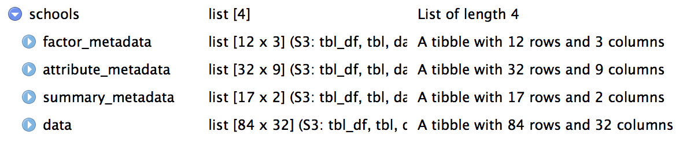

# metajam

Download and read data and metadata from repositories in the DataONE network.  

## Installation

The `metajam` package can be installed from GitHub using the `devtools` package:

```
devtools::install_github("nceas/metajam")
```

## Download data

To download a data object, specify the data object URL and local download path in the `download_d1_data` function:

```
library(metajam)

download_d1_data("https://arcticdata.io/metacat/d1/mn/v2/object/urn%3Auuid%3Ac102bac4-a5ea-4699-bfec-8d4ba60948d8", path = ".")
```
<br>

<br>
<br>

<br>

The output is saved in a folder with the name `{metadata_id}__{file_name}`, which contains the data file and its associated metadata. The metadata follows these conventions:

- `{file_name}__summary_metadata.csv` - summary metadata in a tabular format, which includes date downloaded, data file name, file/metadata URL's, etc.
- `{file_name}__full_metadata.xml` - metadata xml file, if it could be downloaded
- `{file_name}__attribute_metadata.csv` - attribute metadata in a tabular format, if included in the metadata xml
- `{file_name}__attribute_factor_metadata.csv` - attribute factor metadata in a tabular format, if included in the metadata xml

## Read data

The `read_d1_files` function allows you to read the downloaded data and metadata directly into your R environment. Simply run the function with the folder path to the downloaded objects, and all data and metadata files will be returned as data frames stored in a list. Use `{object_name}$data` to access the data, and `{object_name}${metadata_type}_metadata` to access its associated metadata.

```
schools <- read_d1_files("./doi_10.18739_A2DP3X__Alaska_Schools_Rentention2009_15")
```

<br>

<br>
