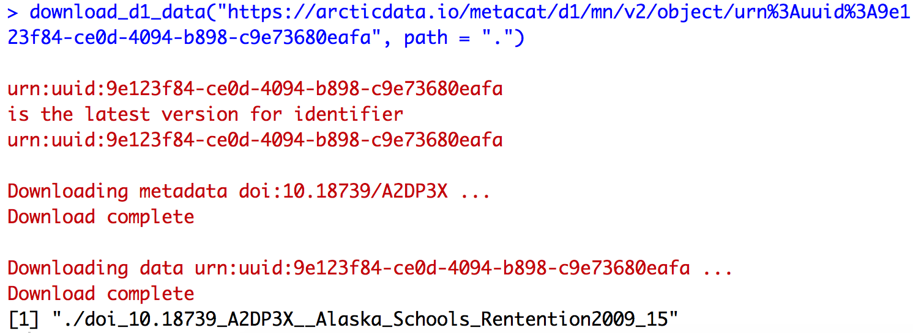
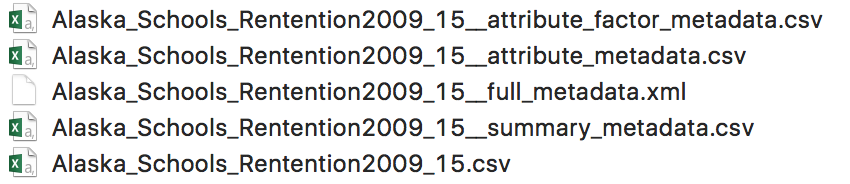

## metajam
<!-- badges: start -->
[](https://github.com/NCEAS/metajam/actions)
[](https://github.com/NCEAS/metajam/actions/workflows/R-CMD-check.yaml)
[](https://CRAN.R-project.org/package=metajam)
<!-- badges: end -->

Download and read data and metadata from repositories in the DataONE network.  

## Authors

Julien Brun, Irene Steves, Mitchell Maier, Kristen Peach and Nick Lyon as main contributors; with special thanks to Colin Smith, Derek Strong and Nathan Hwangbo for their contributions to this package.


## Installation

The `metajam` package can be installed from CRAN:

```r
install.packages("metajam")
```

The development version of `metajam` package can also be installed from GitHub using the `devtools` package:

```r
#install.packages("devtools")
devtools::install_github('NCEAS/metajam')
```

## Workflow

The process of using `metajam` is as follows:

1. Get the URL for the dataset to download
2. Download the data and metadata (`metajam::download_d1_data`)
3. Read the data and metadata into R (`metajam::read_d1_files`)

These steps are described in greater detail--with included examples--below.

## How to get the URL to your dataset of interest ?

From DataONE or any currently supported data repository ([KNB](https://knb.ecoinformatics.org/), [Arctic Data Center](https://arcticdata.io/), or [EDI/LTER](https://portal.edirepository.org/nis/home.jsp)), you can right-click on the `Download` button of a specific dataset and choose `Copy Link Address` to copy the URL to your clipboard

<br>

<br>

## Download data

To download a data object, specify the data object URL and local download path in the `download_d1_data` function:

```
library(metajam)

download_d1_data("https://arcticdata.io/metacat/d1/mn/v2/object/urn%3Auuid%3A9e123f84-ce0d-4094-b898-c9e73680eafa", path = ".")
```
<br>

<br>
<br>

<br>

The output is saved in a folder with the name `{metadata_id}__{file_name}`, which contains the data file and its associated metadata. The metadata follows these conventions:

- `{file_name}__summary_metadata.csv` - summary metadata in a tabular format, which includes date downloaded, data file name, file/metadata URLs, etc.
- `{file_name}__full_metadata.xml` - metadata xml file, if it could be downloaded
- `{file_name}__attribute_metadata.csv` - attribute metadata in a tabular format, if included in the metadata xml
- `{file_name}__attribute_factor_metadata.csv` - attribute factor metadata in a tabular format, if included in the metadata xml

## Read data

The `read_d1_files` function allows you to read the downloaded data and metadata directly into your R environment. Simply run the function with the folder path to the downloaded objects, and all data and metadata files will be returned as data frames stored in a list. Use `{object_name}$data` to access the data, and `{object_name}${metadata_type}_metadata` to access its associated metadata.

```
schools <- read_d1_files("./doi_10.18739_A2DP3X__Alaska_Schools_Rentention2009_15")
```

<br>

<br>

## Additional resources for `metajam`

- Recent presentation on `metajam` and its functionalities: [Click here](https://brunj7.github.io/metajam-presentations/metajam-nceas-roundtable18.html)
- `metajam` demo: [Click here](https://brunj7.github.io/metajam-presentations/metajam-demo.html)
- Package website: https://nceas.github.io/metajam/

## Acknowledgements

Work on this package was supported by:

- NSF-PLR grant #1546024 to M. B. Jones, S. Baker-Yeboah, J. Dozier, M. Schildhauer, and A. Budden
- Long Term Ecological Research (LTER) National Communications Office (LNCO), NSF grant #1545288 to F. Davis, M. Schildhauer, S. Rebich Hespanha, J. Caselle and C. Blanchette

Thanks also go to NCEAS computing team members Mark Schildhauer, Peter Slaughter, Dominic Muellen, Steven Chong, Jesse Goldstein and Matt Jones for their inputs on this package.


