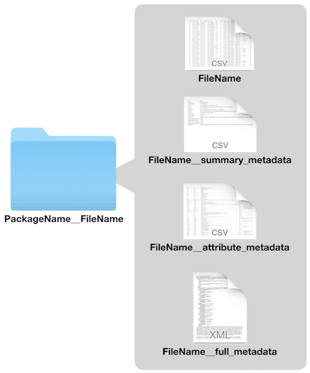

metajam
========================================================
author: Julien Brun, Irene Steves, Mitchell Maier
date: 2018-06-26
autosize: true
css: styles.css

Motivation
========================================================

1. Access data and associated metadata simultaneously
2. Keep data and metadata bundled together
3. Simple interface for users unfamiliar with DataONE
4. Simple output for users unfamiliar with EML/XML

Simple to Run
========================================================

Just pass in:
 1. a data URL 
 2. a path to a folder


```r
#set inputs

data_obj <- "https://arcticdata.io/metacat/d1/mn/v2/object/urn%3Auuid%3Aae6237a1-ac1b-4282-87a5-99f1ab0d11a5"
path <- "~/Desktop/My_Data"
```


```r
#download data and metadata

metajam::download_d1_data(data_obj, path)
```

Output Structure
========================================================

<center>
</img>
</center>

Read File Into R
========================================================


```r
my_data <- metajam::read_d1_files("doi_10.18739_A2CD5M__ASDN_Bird_captures")
summary(my_data)
```

```
                   Length Class  Mode
factor_metadata      3    tbl_df list
attribute_metadata  10    tbl_df list
summary_metadata     2    tbl_df list
data               112    tbl_df list
```


```r
head(my_data$summary_metadata)
```

```
# A tibble: 6 x 2
  name            value                                                   
  <chr>           <chr>                                                   
1 File_Name       ASDN_Bird_captures.csv                                  
2 Date_Downloaded 2018-06-26 14:49:50                                     
3 Data_ID         urn:uuid:ae6237a1-ac1b-4282-87a5-99f1ab0d11a5           
4 Data_URL        https://arcticdata.io/metacat/d1/mn/v2/object/urn:uuid:…
5 Metadata_ID     doi:10.18739/A2CD5M                                     
6 Metadata_URL    https://arcticdata.io/metacat/d1/mn/v2/object/doi:10.18…
```
