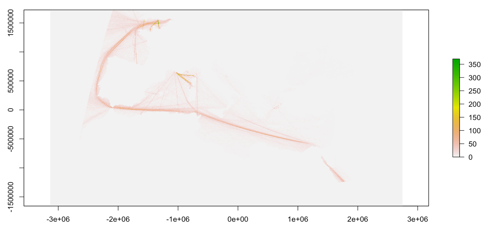
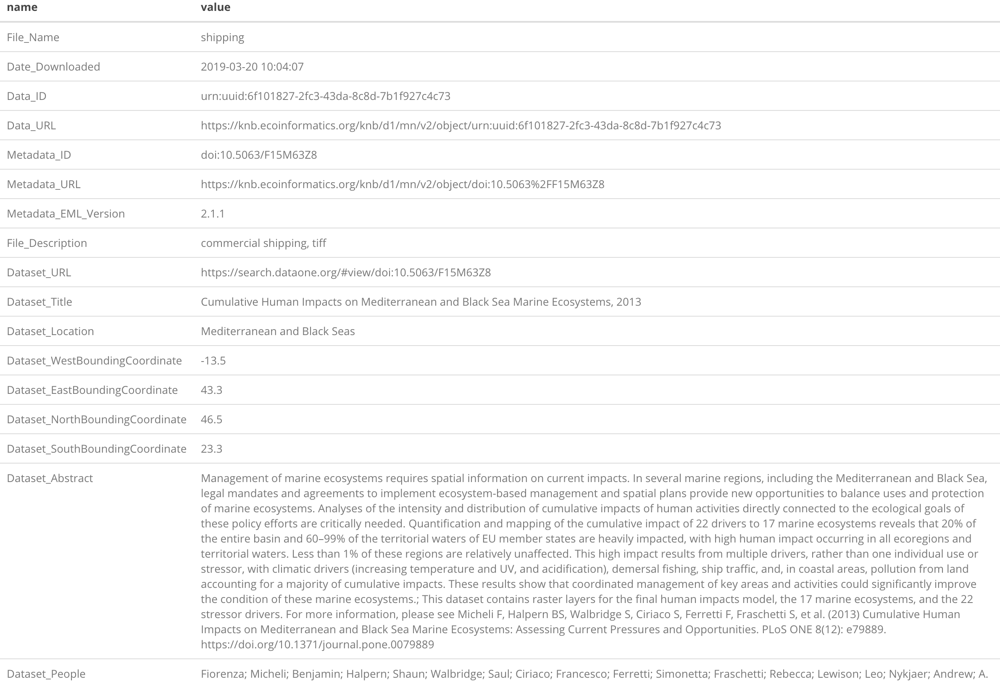

```{r setup, include = FALSE}
knitr::opts_chunk$set(collapse = TRUE, comment = "#>")
```

## Summary

This vignette aims to showcase how to overwrite the default function used by `metajam::read_d1_files` (spoiler alert it is `readr::read_csv`) to read none tabular dara. In this specific vignette, we use the example of reading a geotiff file using the `raster` package.

As example, we are using shipping routes frequency data used in the final human impacts model of 17 marine ecosystems and the 22 stressor drivers [DOI: 10.5063/F15M63Z8](https://doi.org/10.5063/F15M63Z8).. For more information on this research, please see Micheli F, Halpern BS, Walbridge S, Ciriaco S, Ferretti F, Fraschetti S, et al. (2013) Cumulative Human Impacts on Mediterranean and Black Sea Marine Ecosystems: Assessing Current Pressures and Opportunities. PLoS ONE 8(12). https://doi.org/10.1371/journal.pone.0079889.  


## Libraries and constants

```{r libraries, warning=FALSE, message=FALSE, eval=FALSE}
# devtools::install_github("NCEAS/metajam")
library(metajam)
library(raster)
library(magrittr)
```

```{r constants, eval=FALSE}
# Directory to save the data set
path_folder <- "Human_impacts"

# URL to download the dataset from DataONE
data_url <- "https://cn.dataone.org/cn/v2/resolve/urn:uuid:6f101827-2fc3-43da-8c8d-7b1f927c4c73"

```


## Download the raster dataset

```{r download, eval=FALSE}
# Create the local directory to download the datasets
dir.create(path_folder, showWarnings = FALSE)

# Download the dataset and associated metdata 
data_folder <- metajam::download_d1_data(data_url, path_folder)
# data_folder
# "Human_impacts/doi_10.5063_F15M63Z8__shipping__tif"
```

At this point, you should have the data and the metadata downloaded inside your main directory; `human_impacts` in this example. `metajam` organize the files as follow: 

- Each dataset is stored a sub-directory named after the package DOI and the file name
- Inside this sub-directory, you will find
    - the data: `shipping.tif`
    - the raw EML with the naming convention _file name_ + `__full_metadata.xml`: `shipping__full_metadata.xml`
    - the package level metadata summary with the naming convention _file name_ + `__summary_metadata.csv`: `shipping__summary_metadata.csv`


## Read the raster file and metadata in your R environment

```{r read_raster, message=FALSE, eval=FALSE}
# Read the raster file and its associated metadata in as a named list
# using the raster:raster function
shipping_routes <-  read_d1_files(data_folder, "raster")

# Plot the raster data
plot(shipping_routes$data)
```
```{r plot, out.width="90%", echo=FALSE, fig.align="center", fig.cap="Shipping routes frequency"}

```  

# Investigate the metadata

```{r read_metadata, eval=FALSE}
shipping_routes$summary_metadata
```
```{r metadata-table, out.width="100%", echo=FALSE, fig.align="center"}

```  

