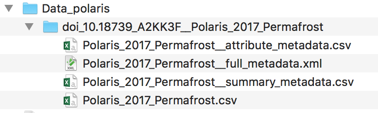
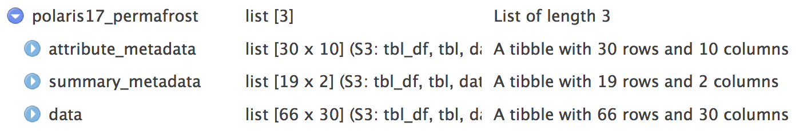

```{r setup, include = FALSE}
knitr::opts_chunk$set(collapse = TRUE, comment = "#>")
```

## Summary

This vignette aims to showcase a use case using the 2 main functions of `metajam` - `download_d1_data` and `read_d1_files` to download one dataset from the [Arctic Data Center](https://arcticdata.io/) data repository.

As example, we are using permafrost data from the Polaris Project 2017:  Sarah Ludwig, Robert M Holmes, Susan Natali, Paul Mann, John Schade, et al. 2018. Polaris Project 2017: Permafrost carbon and nitrogen, Yukon-Kuskokwim Delta, Alaska. Arctic Data Center. [doi:10.18739/A2KK3F](https://doi.org/10.18739/A2KK3F). 


## Libraries and constants

```{r libraries, warning=FALSE}
# devtools::install_github("NCEAS/metajam")
library(metajam)  

```

```{r constants}
# Directory to save the data set
path_folder <- "Data_polaris"

# URL to download the dataset from DataONE
data_url <- "https://arcticdata.io/metacat/d1/mn/v2/object/urn%3Auuid%3Aec704da8-f174-49db-b993-bae479cdc5d9"

```


## Download the dataset

```{r download, eval=FALSE}
# Create the local directory to download the datasets
dir.create(path_folder, showWarnings = FALSE)

# Download the dataset and associated metdata 
data_folder <- metajam::download_d1_data(data_url, path_folder)
# data_folder
# "Data_polaris/doi_10.18739_A2KK3F__Polaris_2017_Permafrost"
```

At this point, you should have the data and the metadata downloaded inside your main directory; `Data_polaris` in this example. `metajam` organize the files as follow: 

- Each dataset is stored a sub-directory named after the package DOI and the file name
- Inside this sub-directory, you will find
    - the data: `my_data.csv`
    - the raw EML with the naming convention _file name_ + `__full_metadata.xml`: `my_data__full_metadata.xml`
    - the package level metadata summary with the naming convention _file name_ + `__summary_metadata.csv`: `my_data__summary_metadata.csv`
    - If relevant, the attribute level metadata with the naming convention _file name_ + `__attribute_metadata.csv`: `my_data__attribute_metadata.csv`
    - If relevant, the factor level metadata with the naming convention _file name_ + `__attribute_factor_metadata.csv`: my_data`__attribute_factor_metadata.csv`

  
```{r, out.width="90%", echo=FALSE, fig.align="center", fig.cap="Local file structure of a dataset downloaded by metajam"}

```  
   

## Read the data and metadata in your R environment

```{r read_data, eval=FALSE}
# Read all the datasets and their associated metadata in as a named list
polaris17_permafrost <- metajam::read_d1_files(data_folder)

```

## Structure of the named list object

You have now loaded in your R environment one named list object that contains the data `polaris17_permafrost$data`, the general (summary) metadata `polaris17_permafrost$summary_metadata` - such as title, creators, dates, locations - and the attribute level metadata information `polaris17_permafrost$attribute_metadata`, allowing user to get more information, such as units and definitions of your attributes.


```{r, out.width="90%", echo=FALSE, fig.align="center", fig.cap="Structure of the named list object containing tabular metadata and data as loaded by metajam"}

```  


